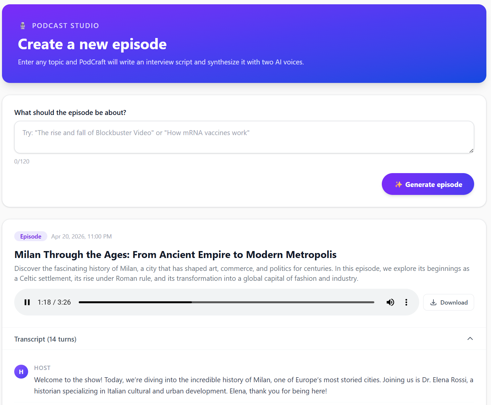

# Azure Podcast Generator

Create short, interview-style podcast episodes from a topic. Authenticated users can generate a script, read the transcript, and listen to audio directly in the browser.

## App preview



## What the app does

- Supports registration, login, profile, and admin flows
- Lets signed-in users open `/podcasts` and submit a topic
- Generates a host-and-guest transcript for the episode
- Plays synthesized audio in the browser
- Listeners can ask a question mid-episode (voice or text) and the host steers the conversation to answer it before the original episode resumes
- Falls back to a mock provider for local development when Azure AI settings are not configured

## Stack

| Layer | Technology |
| --- | --- |
| Frontend | Next.js, React, TypeScript |
| Backend | Express.js, TypeScript |
| AI/audio | Azure OpenAI, Azure AI Speech, or mock provider |
| Testing | Playwright, Cucumber.js, Vitest, Supertest |
| Deployment | Azure Kubernetes Service (AKS) via Azure Developer CLI (`azd`) |
| Local orchestration | Aspire |

## Getting started

Install dependencies:

```bash
npm install
cd src/web && npm install && cd ../..
cd src/api && npm install && cd ../..
```

Run the full app locally:

```bash
npm run dev:aspire
```

Or run the web app and API without Aspire:

```bash
npm run dev:all
```

After the app is running:

1. Register a user or sign in.
2. Open `/podcasts`.
3. Enter a topic such as `History of Boeing`.
4. Generate an episode and play it in the browser.

## Azure AI configuration

If no Azure podcast configuration is present, the API uses a mock provider so the end-to-end flow still works locally.

To use Azure-backed generation, configure:

```text
PODCAST_PROVIDER=azure
AZURE_OPENAI_ENDPOINT=
AZURE_OPENAI_DEPLOYMENT_NAME=
AZURE_SPEECH_REGION=
```

Then choose one of these auth modes:

**API keys**

```text
AZURE_OPENAI_API_KEY=
AZURE_SPEECH_KEY=
```

**Managed identity**

```text
AZURE_SPEECH_RESOURCE_ID=
```

Optional settings:

```text
AZURE_OPENAI_API_VERSION=2024-10-21
PODCAST_HOST_VOICE=en-US-JennyNeural
PODCAST_GUEST_VOICE=en-US-GuyNeural
```

The same `AZURE_OPENAI_*` and `AZURE_SPEECH_*` settings power the **Ask a question** feature: mid-episode listener questions are answered with the same provider, model deployment, and host/guest voices as the original episode.

## Useful commands

| Command | Purpose |
| --- | --- |
| `npm run dev:aspire` | Start the web app and API with Aspire |
| `npm run dev:all` | Run web, API, and docs concurrently |
| `npm run build:all` | Build the API and web app |
| `npm run test:api` | Run API unit tests |
| `npm run test:cucumber` | Run Cucumber tests |
| `npm run test:e2e` | Run Playwright tests |
| `npm run test:all` | Run the full test suite |
| `azd up` | Provision and deploy to Azure |

## Project layout

```text
src/web/      Next.js frontend
src/api/      Express API
src/devbox/   Persistent AKS devbox container
src/shared/   Shared types
e2e/          Playwright tests
tests/        Cucumber tests
infra/        Azure infrastructure and deployment scripts
docs/         Project documentation
```

## Deployment

This repo includes Azure deployment assets for AKS.

```bash
azd auth login
azd up
```

## AKS devbox

The AKS deployment also includes an internal `devbox` workload for cluster-side development and debugging.

- It is **not** exposed publicly through ingress.
- It uses a persistent volume mounted at `/workspace`, so files survive pod restarts and redeploys.
- On first start it bootstraps the repo into `/workspace/azure-podcast-generator`.
- The image includes Azure CLI, Azure Developer CLI, GitHub CLI, GitHub Copilot CLI, and `tmux` for long-running terminal sessions.
- `tmux` sessions survive local terminal disconnects and `kubectl exec` drops, but not devbox pod restarts or redeploys.
- It is useful for live troubleshooting, running commands close to the cluster, and keeping scratch files inside AKS.

Attach to it with:

```bash
kubectl exec -it deploy/devbox -n azure-podcast-generator -- bash
```

Once connected, the project lives at:

```bash
cd /workspace/azure-podcast-generator
```

### Run Copilot in `tmux`

Start an interactive Copilot session that keeps running after your local terminal or `kubectl exec` session disconnects:

```bash
kubectl exec -it deploy/devbox -n azure-podcast-generator -- bash
cd /workspace/azure-podcast-generator
tmux new -s copilot
copilot --yolo --allow-all --continue -p "continue where you left"
```

Detach without stopping it by pressing `Ctrl+b`, then `d`.

If the prompt is stored in a multiline file, use:

```bash
copilot --yolo --allow-all --continue -p "$(< /path/to/prompt.md)"
```

### Run Copilot in the background with a log file

This starts Copilot in a detached `tmux` session and continuously appends console output to `/workspace/copilot-log.txt`:

```bash
kubectl exec -it deploy/devbox -n azure-podcast-generator -- bash
cd /workspace/azure-podcast-generator
: > /workspace/copilot-log.txt
tmux kill-session -t copilot 2>/dev/null || true
tmux new-session -d -s copilot
tmux pipe-pane -o -t copilot 'cat >> /workspace/copilot-log.txt'
tmux send-keys -t copilot 'cd /workspace/azure-podcast-generator && copilot --yolo --allow-all --continue -p "continue where you left"' C-m
```

### Reconnect later

```bash
kubectl exec -it deploy/devbox -n azure-podcast-generator -- bash
tmux ls
tmux attach -t copilot
tail -f /workspace/copilot-log.txt
```

To stop the session entirely:

```bash
tmux kill-session -t copilot
```

If you want Azure-backed podcast generation after deployment, make sure the API workload receives the Azure OpenAI and Azure Speech settings expected by the backend.

## License

[ISC](LICENSE)
